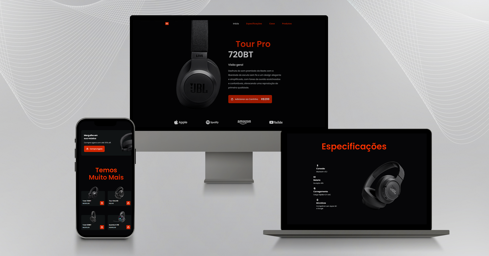

# JBL Landing Page

## Descrição
Esta é uma Landing Page desenvolvida para promover os lançamentos mais recentes da JBL, incluindo fones de ouvido, alto-falantes portáteis e outros dispositivos de áudio. A página é totalmente responsiva, garantindo uma ótima experiência de usuário em dispositivos móveis e desktops.

## Tecnologias Utilizadas
- **HTML5**
- **CSS3**
- **JavaScript**

## Funcionalidades
- **Design Responsivo:** Compatível com dispositivos móveis e desktops.
- **Apresentação de Produtos:** Seções dedicadas a produtos em destaque, com imagens e descrições.
- **Integração com Redes Sociais:** Links para as redes sociais da JBL.

## Preview


## Instalação
1. Clone o repositório:
   ```bash
   git clone https://github.com/Lu1zEduard0/Landing-Page-JBL.git
